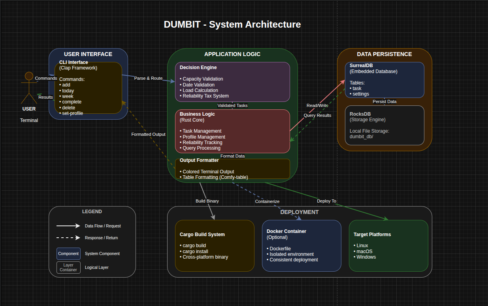

# DUMBIT

**Decision Utility for Managed Balance, Intent & Time**
```
  _____   _    _  __  __  ____   _____  _______ 
 |  __ \ | |  | ||  \/  ||  _ \ |_   _||__   __|
 | |  | || |  | || \  / || |_) |  | |     | |   
 | |  | || |  | || |\/| ||  _ <   | |     | |   
 | |__| || |__| || |  | || |_) | _| |_    | |   
 |_____/  \____/ |_|  |_||____/ |_____|   |_|   
       D E C I S I O N   U T I L I T Y
```

> **Don't do more. Commit better.**

DUMBIT is a high-discipline CLI tool that acts as your **cognitive gatekeeper**. Unlike traditional task managers that accept every commitment, DUMBIT enforces physiological and psychological capacity limits — intelligently rejecting tasks that would lead to over-commitment and burnout.

Built in **Rust** for performance and reliability.

---

## The Problem

Modern professionals over-commit. We say "yes" to too many things, leading to burnout, broken promises, and chronic stress. Traditional task managers enable this by accepting every task regardless of your actual capacity.

**DUMBIT rejects impossible commitments before you make them.**

---

## Quick Start

### Prerequisites

- Rust 1.70+ ([Install Rust](https://rustup.rs/))
- Cargo (bundled with Rust)

### Installation

\```bash
git clone https://github.com/yourusername/dumbit.git
cd dumbit
cargo install --path .
dumbit --version
\```

### First-Time Setup

\```bash
dumbit set-profile --daily 8 --weekly 40
dumbit add "Complete project setup" --hours 2 --deadline 2026-02-15
dumbit today
\```

---

## Usage

### Adding Tasks

\```bash
dumbit add "Fix authentication bug" --hours 3 --deadline 2026-02-20

dumbit add "Design system refactor" \
  --hours 5 \
  --deadline 2026-02-25 \
  --domain "Engineering" \
  --difficulty "HIGH"
\```

**Accepted:**
\```
✔ ACCEPTED Design system refactor
  Cognitive load within parameters.
\```

**Rejected:**
\```
✘ REJECTED Fix authentication bug
  REASON: Capacity full. Limit: 8.0h, Current Load: 6.5h
\```

### Other Commands

\```bash
dumbit today      # Today's accepted tasks
dumbit week       # Weekly outlook
dumbit rejected   # Rejection history
dumbit complete "Fix authentication bug"
dumbit set-profile --daily 6 --weekly 30
\```

---

## How the Decision Engine Works

When you add a task, DUMBIT runs it through the **Decision Engine**:

1. **Date Validation** — Rejects tasks with past deadlines
2. **Capacity Check** — Calculates current daily/weekly load
3. **Reliability Tax** — If reliability < 60%, effective capacity shrinks
4. **Accept or Reject** — Task added or logged to rejected history with reason

---

## Reliability System

| Event | Effect |
|---|---|
| Task completed on time | +5% |
| Task missed / deleted | −5% |
| Reliability < 60% | Capacity tax applied |

---

## Software Design

### Architecture

DUMBIT follows a **Layered Architecture** with three distinct layers: the CLI interface, the application logic (Decision Engine + Business Logic), and the data persistence layer (SurrealDB over RocksDB).



Each layer has a single responsibility and communicates strictly downward. The CLI never touches the database directly, and the data layer has no knowledge of business rules — enforcing low coupling and making each layer independently testable.

### Key Design Decisions

| Decision | Reason |
|---|---|
| Layered Architecture | CLI tools have no UI layer; input → logic → storage maps naturally to layers |
| Decision Engine isolated | All validation in one module — new rules require touching one place only |
| Embedded SurrealDB | No cloud dependency, no auth, zero infra cost, privacy by default |
| Reliability Tax | Behavioral feedback loop — penalizes over-commitment at the source |
| Rust | Type system eliminates null/race bugs; sub-second CLI response is non-negotiable |

### Design Principles Applied

- **Abstraction**: CLI doesn't know how tasks are stored; DB layer doesn't know what a reliability tax is
- **Modularity**: Decision Engine, Business Logic, and Output Formatter are independent modules
- **High Cohesion**: Each module does exactly one thing
- **Low Coupling**: Swapping SurrealDB for SQLite would require changes in one place only

### Design Artifacts

All design files are in [`/design`](./design/):

| File | Description |
|---|---|
| `architecture.drawio` | Editable Draw.io source |
| `architecture.png` | Exported architecture diagram |

---

## Docker

\```bash
docker build -t dumbit:latest .

docker run -it --rm \
  -v dumbit-data:/data \
  dumbit:latest

# Reset data
docker volume rm dumbit-data
\```

---

## Tech Stack

| Layer | Technology |
|---|---|
| Language | Rust 2021 Edition |
| CLI Framework | Clap 4.5 |
| Database | SurrealDB 2.0 (embedded RocksDB) |
| Async Runtime | Tokio 1.40 |
| Date/Time | Chrono 0.4 |
| Terminal UI | Colored 2.1, Comfy-table 7.1 |

---

## Project Structure

\```
dumbit/
├── src/
│   └── main.rs
├── design/
│   ├── architecture.drawio
│   └── architecture.png
├── Cargo.toml
├── Dockerfile
├── README.md
└── LICENSE
\```
